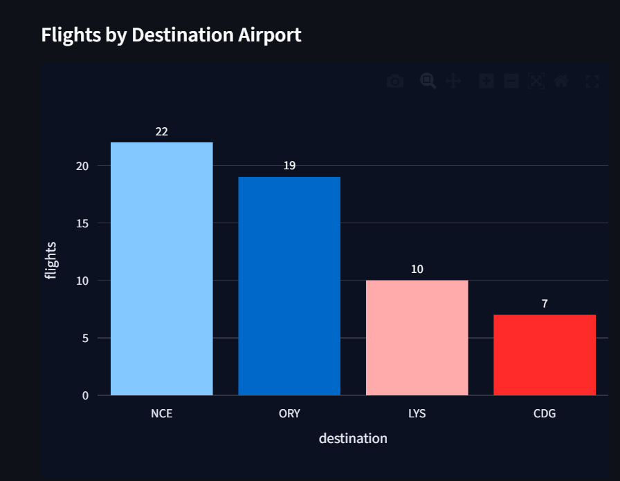
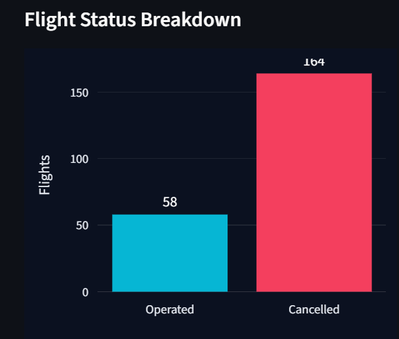
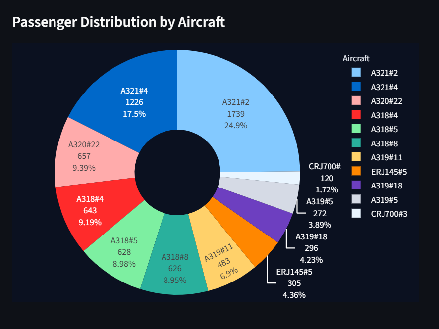
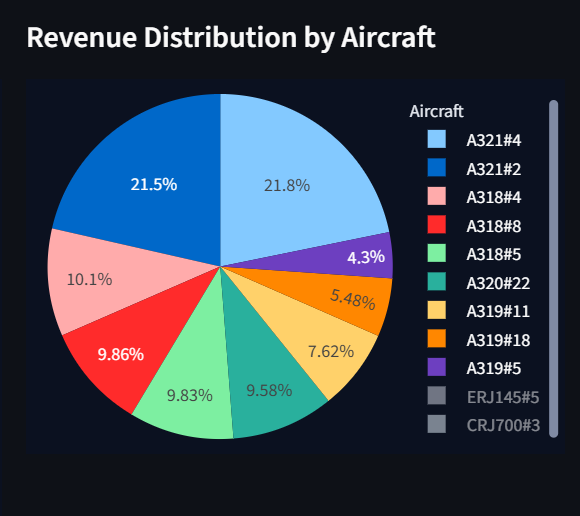
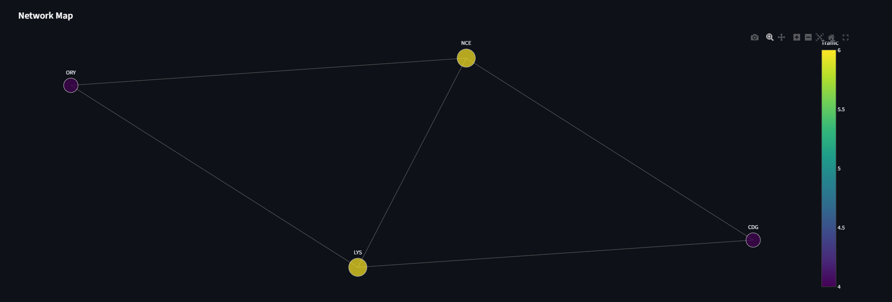
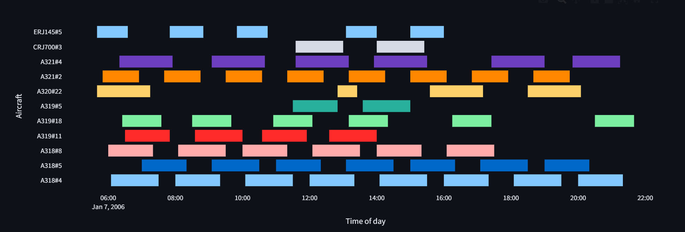
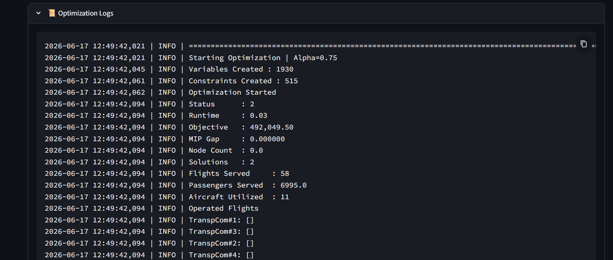
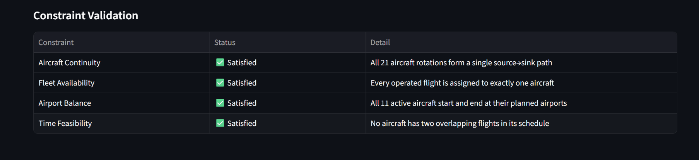

# ✈️ Airline Fleet Assignment & Rotation Dashboard

A comprehensive Streamlit dashboard for visualizing and optimizing airline fleet assignment and aircraft rotation management. This application integrates powerful optimization algorithms with an intuitive UI, featuring interactive charts, real-time analytics, and an AI-powered chat assistant for intelligent insights.


## 📋 Table of Contents

- [Features](#features)
- [Project Structure](#project-structure)
- [Installation](#installation)
- [Configuration](#configuration)
- [Usage](#usage)
- [Dashboard Tabs](#dashboard-tabs)
- [Demo & Screenshots](#demo--screenshots)
- [Data Format](#data-format)

---

## ✨ Features

- 📊 **Interactive Dashboards** — 6 comprehensive tabs with real-time data visualization
- 🤖 **AI Chat Assistant** — Groq-powered intelligent Q&A about optimization results
- ✈️ **Fleet Optimization** — Aircraft assignment and rotation scheduling
- 📈 **Advanced Analytics** — KPIs, route analysis, network graphs, and constraint validation
- 🔍 **Detailed Tracking** — Flight assignments, aircraft utilization, and operational metrics
- 📊 **Solver Diagnostics** — MIP optimization status, runtime, and gap analysis

---

## 📁 Project Structure

```
airlineplanning/
├── app.py                          # Main Streamlit application (entry point)
├── data_loader.py                  # Data loading & KPI computation
├── data_loader_opt.py              # Optimization data loading
├── data_processor.py               # Data processing utilities
├── optimizer.py                    # Optimization engine
├── main.py                         # Backend core logic
├── streamlit.py                    # Streamlit configuration
├── requirements.txt                # Python dependencies
├── README.md                       # This file
│
├── data/
│   ├── inputs/                     # Input files for optimization
│   │   ├── flight_rotations.csv
│   │   ├── flight_iterinaries.csv
│   │   ├── starting_positions.csv
│   │   └── ending_positions.csv
│   ├── outputs/                    # Optimization results
│   │   ├── aircraft_summary.csv
│   │   ├── flight_assignments.csv
│   │   ├── route_assignments.csv
│   │   └── solver_summary.csv
│   └── logs/                       # Solver logs and models
│       ├── airline_model.lp
│       └── airline_solution.sol
│
└── image/                          # Visual assets & demo
```

### Install Dependencies

```bash
pip install -r requirements.txt
```
## 🚀 Installation

### Prerequisites
- Python 3.8+
- pip (Python package manager)

### Clone or Download the Project

```bash
cd airlineplanning
```
---

## ⚙️ Configuration

### Solver Diagnostics

Solver Details
Optimization Type: Mixed Integer Programming (MIP)
Solver: Gurobi Optimizer
Interface: GurobiPy
Objective: Maximize operational efficiency and profitability while satisfying all scheduling constraints
Solution Method: Branch-and-Bound with advanced presolve and cutting-plane techniques


### Set up the Groq API Key (for Chat Assistant)

You have two options — the key is never hardcoded into the app:

- **Easiest:** paste your key directly into the password field in the
  sidebar when the app is running.
- **Persistent:** set an environment variable before launching:
  ```bash
  export GROQ_API_KEY="your-key-here"
  ```
  Or copy `.streamlit/secrets.toml.example` to `.streamlit/secrets.toml` and
  fill in your key.

Get a free key at https://console.groq.com.

---

## 💻 Usage

#### 🚀 Run the Project Locally
Clone the repository:

```bash
git clone <your-repository-url>
cd <repository-name>
```

Install the required dependencies:

```bash
pip install -r requirements.txt
```

Launch the Streamlit application:

```bash
streamlit run app.py
```

After the application starts, open your browser and navigate to:

```text
http://localhost:8501
```

You will be able to explore the Airline Scheduling Optimization Dashboard, view optimization results, analyze KPIs, and interact with the AI Assistant.


---

## 📊 Key Dashboard Views

<table>
<tr>
<td align="center">

<br><b>Flight Distribution</b>
</td>

<td align="center">

<br><b>Flight Status</b>
</td>

<td align="center">

<br><b>Passenger Analytics</b>
</td>
</tr>

<tr>
<td align="center">

<br><b>Revenue Analysis</b>
</td>

<td align="center">

<br><b>Network Graph</b>
</td>

<td align="center">

<br><b>Aircraft Timing</b>
</td>
</tr>
</table>

---


### **Optimization Results**

Detailed solver performance and constraint validation:

- **Solver Diagnostics:**
  - Optimization status (Optimal, Feasible, etc.)
  - Objective value (total operating cost)
  - Runtime and optimality gap (MIP gap %)
  - Variable and constraint counts
- **Scheduling Summary:**
  - Aircraft assignment statistics
  - Flight coverage analysis
  - Utilization vs capacity
- **Constraint Validation:**
  - Computed from actual data (not hardcoded)
  - Aircraft availability windows
  - Maintenance slots
  - Turnaround time compliance
- **Expandable Solver Log:**
  - Branch-and-cut iteration details
  - Solution quality progression
  - Diagnostic messages

-  - *Solver diagnostics and performance metrics*
-  - *Constraint satisfaction verification*

---

### **Chat Assistant (AI-Powered)**

Intelligent Q&A powered by Groq's language model:

- **Natural Language Queries** — Ask questions about your optimization results in plain English
- **Context-Aware Responses** — Assistant understands your fleet, routes, and assignments
- **Real-Time Analysis** — Get on-demand insights without manual drilling
- **Example Questions:**
  - "Which aircraft has the highest utilization?"
  - "What's the most profitable route?"
  - "How many flights are cancelled due to aircraft unavailability?"
  - "Show me the busiest airport by passenger volume"

**Demo:** See the chat assistant in action in the video below!

---

## 🎬 Demo & Screenshots

### Interactive Demo Video

Watch the AI chat assistant and full dashboard in action:

**[▶️ Watch Demo Video](image/chat_boat_demo.mp4)**

*Duration: ~2 minutes | Shows chat interactions, dashboard navigation, and real-time analytics*

---


## 📝 Data Format Details
### Data

| File | Type | Required Columns |
|---|---|---|
| `flight_rotations.csv` | **Input** | flight, date, aircraft, ori, des, start_time, end_time, duration |
| `starting_positions.csv` | **Input** | aircraft, airport |
| `ending_positions.csv` | **Input** | aircraft, airport |
| `flight_iterinaries.csv` | **Input** | cost, n_pass, flight, total_cost |
| `aircraft_summary.csv` | **Output** | aircraft, assigned_flights, passengers, revenue |
| `flight_assignments.csv` | **Output** | aircraft, flight, origin, destination, passengers, revenue |
| `route_assignments.csv` | **Output** | aircraft, from_node, to_node |

**Note:** A flight present in `flight_rotations.csv` but absent from
`flight_assignments.csv` is automatically treated as **Cancelled**.

### Input Data Format

**flight_rotations.csv** — Available flights to schedule
- Defines the universe of flights the optimizer can assign to aircraft

**starting_positions.csv** — Initial aircraft locations
- Airport where each aircraft begins its day

**ending_positions.csv** — Final aircraft destinations
- Airport where each aircraft must end its day (for next-day continuity)

**flight_iterinaries.csv** — Flight economics
- Operating cost per flight, passenger demand, total cost per rotation

### Output Data Format

**aircraft_summary.csv** — Fleet-level results
- Flights assigned, total passengers, revenue per aircraft

**flight_assignments.csv** — Individual flight allocations
- Which aircraft is assigned to each flight
- Passenger count and revenue impact

**route_assignments.csv** — Network routing
- Arc-based representation (from_node → to_node) of aircraft movements

---

## 🔧 Troubleshooting

**Issue:** App crashes when loading data
- **Solution:** Verify column names match exactly (case-sensitive)

**Issue:** Chat assistant not responding
- **Solution:** Ensure Groq API key is set and has available credits

**Issue:** Slow performance with large datasets
- **Solution:** Consider filtering data or increasing server resources

---

## 📞 Support & Contribution

For issues, feature requests, or contributions, please check the project documentation or reach out to the development team.

---

**Last Updated:** June 2026 | **Status:** Production Ready ✅
- **Chat Assistant** — ask natural-language questions about the loaded results; powered by Groq (`llama-3.3-70b-versatile` by default).

## Notes

- All computations (KPIs, utilization, constraint checks, network stats) are derived live from whatever CSVs are in `data/` — swap in new data and everything recalculates automatically.
- Constraint validation actually checks the data (aircraft continuity through the time-space network, no double-booked flights, time overlaps, start/end base matching) rather than always reporting "Satisfied".
